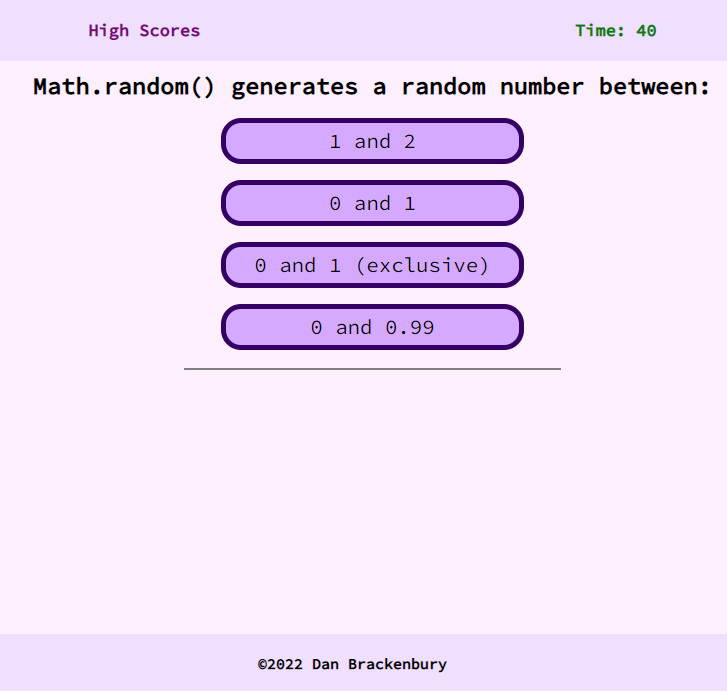

# JavaScript Online Quiz
## A way to test your knowledge of JavaScript

An online quiz that bombards the user with various questions about JavaScript in the hopes that it might help them retain some of their knowledge!

Randomly shuffles questions / answer cards to keep users on their toes and avoid purely rote memorization of the quiz format.

The quiz contains 13 questions and stores up to six high scores.

Assembled using HTML / CSS / JavaScript.

### Additional questions taken from [DataFlair](https://data-flair.training/blogs/javascript-quiz/)
